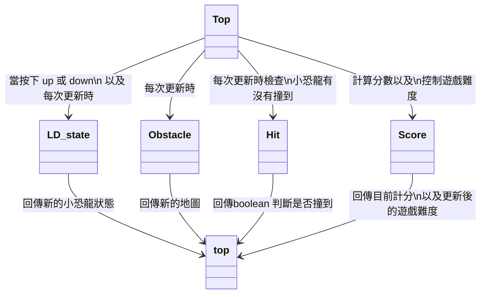

# DigitalSystem FinalProject
## LittleDinosaur
### module Top () ;

圖的陣列 , 小恐龍狀態 , up and down 指令。

### module LD_state(); 按上下時小恐龍的狀態

### module Obstacle(); 生成新的圖

### module Hit() ; 撞到障礙物

### module Score(); 分數計算、遊戲加速

**備註： 此 top 也是此 Top**
