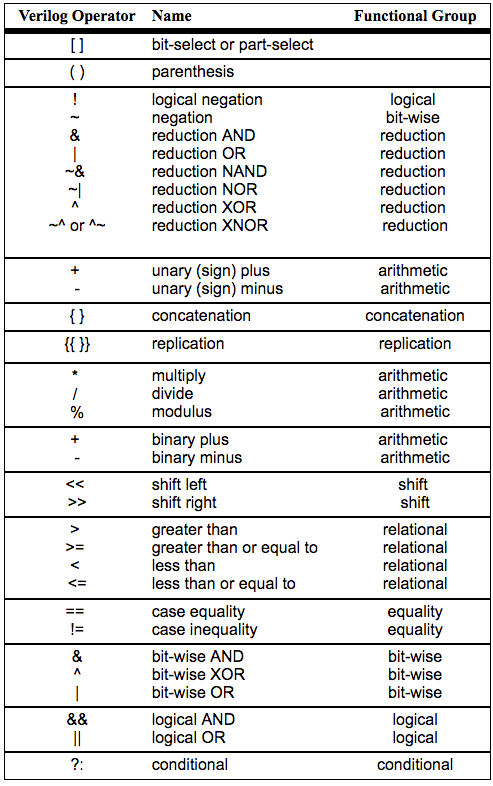

# VerilogNote
---
## Basic Declaration
```
//範例
module Add_half (sum,c_out, a,b);

    input a , b ;
    output sum , c_out ;
    wire c_out_bar;

    xor (sum , a , b);
    nand (c_out_bar , a,b );
    not(c_out,c_out_bar) ;

endmodule
```
### module
Verilog Module 可以視為是 basic building block 。後面的括弧裡面放 input,output 的腳位，
記得module那一行最後要加分號" ; "，

同時記得最後一定要在結尾處加個**endmodule**。

### input , output
負責輸入輸出腳位，可以跟 module的 wire合併。
+ input : input 必須要為 wire，input 本身預設就為 wire，因此不必特別去改。
+ output : output 可以為 wire 或 reg ，預設為 wire ，若想宣告為 reg ，
可輸入 output reg < 變數名稱 > ;

### assign 
```
assign temp = a&b ;
```
把運算的結果 assign 給一個 wire 變數。!!! 一定要是 wire !!!

---


## 3 Methods to Describe the Circuit 

### Structural Description
```
module HA(a, b, sum, carry);
    input a, b;
    output sum, carry;
    reg sum, carry;

    always@(a or b)
    begin
        sum = a^b;
        carry = a&b;
    end
endmodule

module FA(x,y,c_in,sum,c_out);
    input x,y,c_in;
    output sum,c_out;
    wire w1 , w2, w3 ;

    HA half_adder1 (.a(x) , .b(y) , .sum(w1) , .carry(w2) ) ;
    HA half_adder2 (.a(c_in) , .b(w1) , .sum(sum) , .carry(w3) );
    or(c_out , w2 , w3) ;
endmodule
```
利用不同的module，來完成電路，通常用在high-level。

### Data Flow Descriptioni

```
module FA(x,y,c_in,sum,c_out);
    input x,y,c_in;
    output sum,c_out;

    assign{c_out , sum } = x+y+c_in ;

endmodule
```

data flow 是利用 wire 來串接在一起的表示方式。

### Behavior Description 
```
module FA(x,y,c_in,sum,c_out);
    input x,y,c_in;
    output sum,c_out;
    reg sum , c_out ;
    wire a , b, c ;

    always@(x or y or c_in)
    begin
        {c_out , sum } = x+y+c_in ; //{cout , sum} 當作兩個 bits
    end
endmodule
```
Behavior 是用 reg ( Register , but not necessarily FF ) 來表示電路
，因此常跟 always 搭配使用。

此外 Behavior 裡面的 always 裡面可以直接放個 truth table 來表示整個 
circuit 的 behavior。
```
// Behavior Description with Truth Table inside .
module SevenSegment(in,out);
    input [3:0] in ;
    output reg  [6:0] out ;

    always@(in)
    begin
        case(in)
        4'h 0 : out = 7'b 1000000;
        4'h 1 : out = 7'b 1111001;
        4'h 2 : out = 7'b 0100100;     
        4'h 3 : out = 7'b 0110000;     
        4'h 4 : out = 7'b 0011001;     
        4'h 5 : out = 7'b 0010010;      
        4'h 6 : out = 7'b 0000010;     
        4'h 7 : out = 7'b 1111000;     
        4'h 8 : out = 7'b 0000000;      
        4'h 9 : out = 7'b 0010000;
        4'h a : out = 7'b 0001000;
        4'h b : out = 7'b 0000011;
        4'h c : out = 7'b 1000110;
        4'h d : out = 7'b 0100001;
        4'h e : out = 7'b 0000110;
        4'h f : out = 7'b 0001110;
        endcase
    end
endmodule
```
```
個人想法：
Structural Behavior 適用在 high-level。
Data Flow & Behavior 適用在 low-level。
```

---
## Instance Name 
A module must have a name .
```
//example
or u1 (Temp[0] , IN[0] , IN[1]);
or u2 (Temp[1] , IN[2] , IN[3]);
and u3 (Out , Temp[0] , Temp[1]);
```
+ or 以及 and 是 module 。
+ u1 , u2 , u3 是 instance name 。 

### Port Mapping 
+ In Order : 按照原先 module 順序依序填入 intput , output 。
+ By Name : 可自行填整填入位置，但是要用 .portname(variable) 的
形式來標注每一個 port 。

---
## Numbers 
Numbers are integer or real constants . 

Integer constants are written as
```
<size>'<base format><number> 
```  
### Base Format
The base  format indicates the type of the number .
+ Decimal (d or D)
+ Hex (h or H)
+ Octol (o or O)
+ Binary (b or B)

---
## Parameterized Design 
```
module PARAM(A,B,C) ;
    input [7:0] A,B ;
    output [7:0] C ;
    wire f ;
    or o1 (f,A,B);
    test #(4) u1 (A,f,C) ; //#() 可以用來調整 module 裡面的 parameter 變數。
endmodule

module test (a,b,c) ;
    parameter width = 8 ; //default
    input [width-1 : 0]a,b ;
    output[width-1 : 0] c;

    assign c = a & b ;

endmodule
```
---
## Expressions 
### Verilog Operands
+ Identifers 
+ literals
    + string (bit & character) e.g. 4'b 1101
    + numeric (integet , real) e.g. 34
+ Function Call
+ Index & Slice Names
```
module LITERALS(A1,A2,B1,B2,Y1,Y2) ;
    input A1,A2,B1,B2 ;
    output[7:0] Y1 ; 
    output[5:0] Y2 ;
    parameter CST=4'b1010 , TF=25 ;

    always@(A1 or A2 or B1 or B2)
    beign
        if(A1 == 1)
            Y1={CST,4'b 0000}; // Tips : 可以使用大括號{} 來達到串接效果
        else if(A2 == 1)
            Y1={CST,4'b 0101}; 
        else
            Y1={CST,4'1111};
        if(B1 == 0)
            Y2 = 10 ;
        else if(B2 == 1)
            Y2 = 15 ;
        else 
            Y2 = TF + 10 + 15 ;
    end
endmodule 
```

### Verilog Operators

```
module Concatenation(A,B,Y);
    input[2:0] A ;
    input[2:0] B ;
    output reg [14:0] Y;

    always@(A)
    begin
        Y={B,A,{2{C}},3'b 001}; //{2{C}} 表示 C 重複兩次
    end
endmodule

```
---
## Flow of Control
### If-Else Statements
```
if(expression)
    begin
        statements ;
    end
else if(expression)
    begin
        statements ;
    end
else
    begin
        statements ;
    end
```
在寫 if-else 的時候請注意 latches 的情況發生。

if-else 要寫好寫滿。

### Case Statements
```
case(expression)
    item1:
    begin
        statements ;
    end
    item2:
    begin
        statements ;
    end
    ...
    default:
    begin
        statements ;
    end
endcase

```
同樣的為了要避免有 latches 的情況發生，條件要寫滿。

### For Loop statement
unrolling the logic ，基本上不會用到它。

### Always Block
```
//Combinational Circuit
always@(event-expression) //只要 event-expression 裡面的值有變化就執行
begin
    statements;
end

```
```
//Sequential Circuit
always@([posedge or negedge] event) // 只有在 posedge (negedge) 的時候才產生變化
begin 
    statements 
end
```
### Function Statements
```
module Fun_STATE(A,B,C1,C2,C3,C4,C5);
input[3:0]A , B;
output [6:0] C1;

function [4:0] Fn1;
    intput[3:0]A,B;
    FN1 = A+B;
endfunction

always@(A or B)
begin
    C1=Fn1(A,B)
end
endmodule
```


